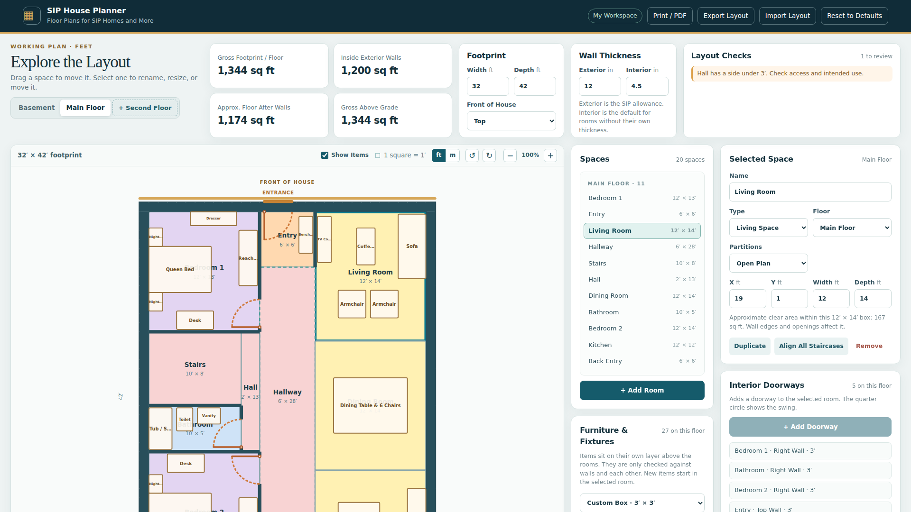
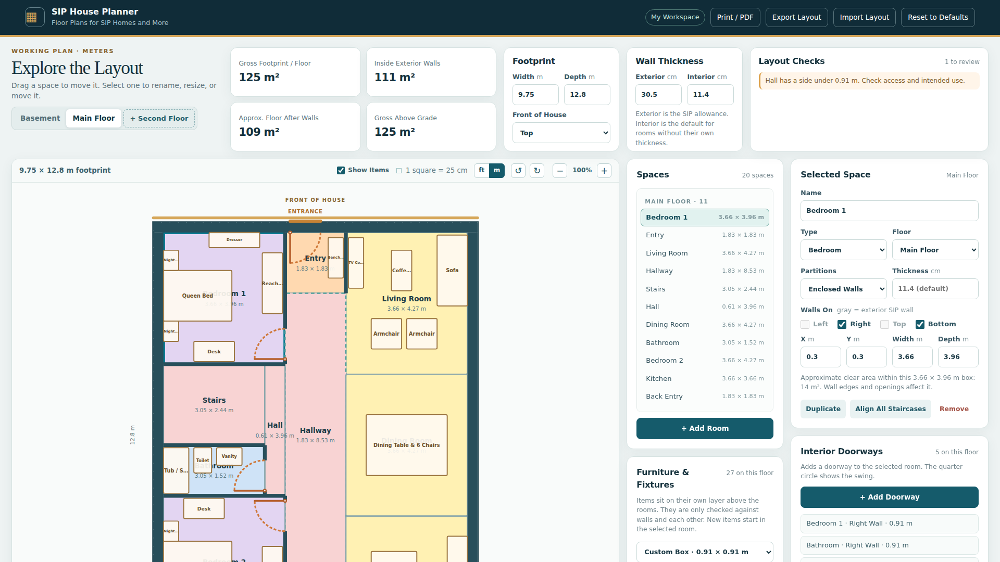
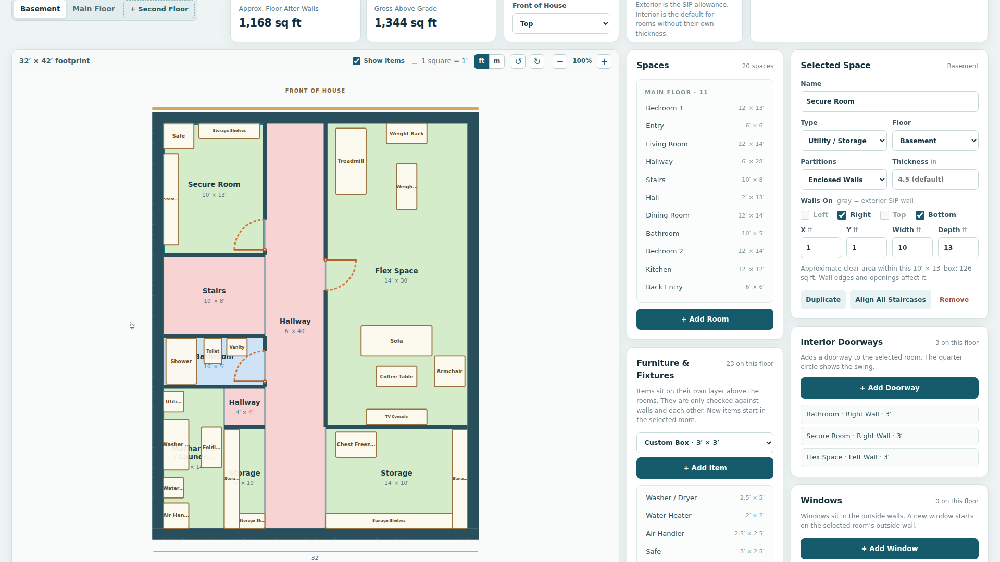
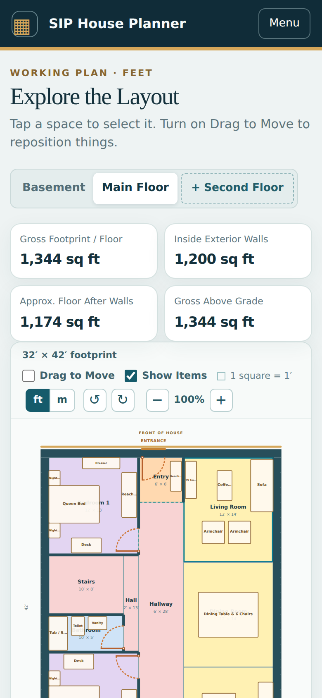

# SIP House Planner

A browser-based floor plan tool for concept planning a SIP (structural insulated panel) house. It works just as well for any small home or apartment layout.

**Try it:** [sal-r.github.io/sip-house-planner](https://sal-r.github.io/sip-house-planner/)



It's plain HTML, CSS, and JavaScript: no build step, no frameworks, no dependencies, and nothing to install. Your layout is saved in your own browser and is never uploaded anywhere.

## Features

- **Feet or metric:** switch between feet and inches or meters and centimeters at any time. Layouts are saved the same way in both, so any file opens in either.
- **Rooms:** add, name, move, and resize spaces on a plan drawn to scale with a 1′ grid. Rooms are color-coded by type (living space, bedroom, bathroom, entry, hallway or stairs, utility or storage).
- **Walls:** set the exterior and interior wall thicknesses to match real SIP panels, like 6½″ or 8¼″ walls. Each room can be open plan or enclosed, with its own wall thickness and per-side wall toggles.
- **Doorways:** add interior doorways with hinge side and swing direction. Doorways on an outside wall are marked as entrances automatically.
- **Windows:** place windows along the exterior walls, and drag them along a wall or over to another wall. **Center on Room** slides the selected window to the middle of its room's wall.
- **Furniture and fixtures:** 21 presets (beds, sofas, cabinets, appliances, bathroom fixtures, and more) plus a custom box, on their own layer.
- **Multiple floors:** basement, main floor, and an optional second floor, with a one-click option to align the staircases.
- **Layout checks:** flags overlapping rooms, rooms outside the footprint, stairs that don't line up between floors, doorways too close to corners, items hitting walls, and more.
- **Area figures:** gross footprint, area inside the exterior walls, and approximate floor area after walls.
- **Plan tools:** zoom, rotate the whole house 90°, mark the front of the house, and resize the plan area.
- **Save and share:** autosaves in your browser. Export and import layouts as JSON files.
- **Print to PDF:** prints one letter-size landscape page per floor, with a room list.
- **Works on phones:** the layout adapts to small screens, with a Drag to Move switch so swiping still scrolls the page.

## Screenshots

| Main floor | Metric | Basement | Phone |
| --- | --- | --- | --- |
|  |  |  |  |

<!-- To update these, replace the files in assets/screenshots/ and keep the same names. -->

## Using it online

Open the [live site](https://sal-r.github.io/sip-house-planner/). The first time, it loads the default layout. After that, your changes save automatically in that browser.

- **Select** a room, doorway, window, or item by clicking it on the plan or picking it from the dropdown in its side panel. Each dropdown is grouped by floor and has an info box with the total and the count on each floor.
- **Move** things by dragging them. On a touch screen, turn on **Drag to Move** first.
- **Undo:** the **Undo** button above the plan (or Ctrl+Z, Cmd+Z on a Mac) steps back through your last 50 changes, including a whole drag, a Reset to Defaults, or an import. Selecting things, zooming, switching floors, and changing units are not counted. The history is kept in memory only, so it starts empty each time the page loads.
- **Suggested sizes:** every panel has the same layout (summary, dropdown, Add button, Suggested sizes menu, then the fields). The Suggested sizes menu applies to whatever is selected: half or full bath for spaces, common widths for doorways and windows, and standard furniture and fixture sizes for items.
- **Edit** the selected space's name, type, floor, walls, position, and size in the **Spaces** panel, under the dropdown.
- **Keep a copy** with **Export Layout**. Use **Import Layout** to load it back, on this or any other browser.
- **Switch units** with the **ft / m** buttons above the plan. The planner starts in feet for US browsers and in metric elsewhere, and remembers your choice.
- **Start over** with **Reset to Defaults**.

### Keyboard

| Key | Action |
| --- | --- |
| Tab | Move between rooms, doorways, windows, and items on the plan |
| Enter or Space | Select the focused shape |
| Arrow keys | Move the focused shape 6″ or 10 cm (windows 3″ or 5 cm). Doorways and windows slide along their wall |
| Shift + arrow keys | Move 1′ or 25 cm |
| Up / Down on the resize bar | Make the plan area shorter or taller |

## Running it locally

Because the app reads `default-layout.json` with `fetch`, it needs to be served over http rather than opened as a file.

**Windows:** double-click `Start-Planner.bat`. It starts a local server with Python (conda installs and the `py` launcher are detected automatically) and opens the planner at `http://127.0.0.1:8000`. The server only listens on your own computer. If it can't find Python, open the .bat in a text editor and follow the note at the top.

**macOS or Linux:** from this folder, run:

```bash
python3 -m http.server 8000 --bind 127.0.0.1
```

Then open `http://127.0.0.1:8000`.

Opening `index.html` directly (a `file://` address) also works, but it falls back to the built-in layout because browsers block reading `default-layout.json` from disk.

> Browser drafts are stored per website, so a layout saved on the live site won't appear on your local copy, and the reverse. Use Export Layout and Import Layout to move work between them.

## Changing the default layout

The default layout is whatever is in `default-layout.json`. To replace it with your own design:

1. Open the planner and arrange the layout you want as the new default.
2. Click **Export Layout**. This downloads a file named like `sip-house-layout-2026-09-27.json`.
3. Rename that file to `default-layout.json`.
4. Replace the existing `default-layout.json` in this folder (and commit it, if you're publishing to GitHub Pages).

New visitors and anyone who clicks **Reset to Defaults** will get the new layout. People with a saved draft keep their draft until they reset.

## Project structure

```
sip-house-planner/
├── index.html              Page structure
├── styles.css              All styles
├── app.js                  All app logic
├── default-layout.json     Layout loaded on first visit and on reset
├── assets/
│   ├── favicon.svg, favicon-32.png, apple-touch-icon.png
│   ├── og-image.png        Link preview image (1200 × 630)
│   └── screenshots/        Images used in this README
├── Start-Planner.bat       Local launcher for Windows
├── START-HERE.txt          Quick local instructions for Windows
├── README.md
├── TEST-CHECKLIST.md       Manual test pass before each release
├── LICENSE
├── .gitignore
├── .gitattributes          Keeps Windows line endings in the .bat file
└── .nojekyll               Tells GitHub Pages to serve files as-is
```

### Publishing on GitHub Pages

1. Push these files to the root of the `main` branch.
2. In the repository, go to **Settings → Pages**.
3. Under **Build and deployment**, choose **Deploy from a branch**, then **main** and **/ (root)**, and save.
4. The site will be live at `https://sal-r.github.io/sip-house-planner/` within a minute or two.

## Important: concept tool only

SIP House Planner is for early concept sketches. **It is not a construction document.** Dimensions are nominal, areas are approximate, and the layout checks only catch obvious conflicts. Structure, SIP panel layout, spans, HVAC, plumbing, electrical, egress, and building code compliance all need review by qualified professionals such as an architect, engineer, SIP manufacturer, and your local building department.

## License

Copyright © 2026 Sal-r. All rights reserved. You're welcome to use the hosted app. The source code and assets are not licensed for reuse. See [LICENSE](LICENSE).
